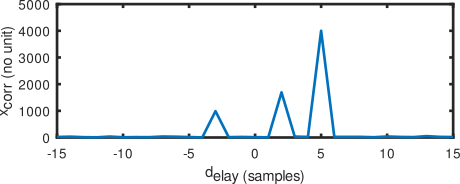
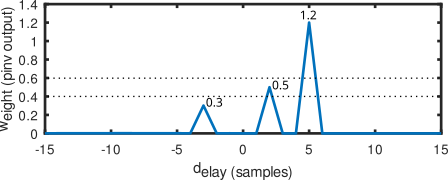

# BLAS examples

Executing the C program ``demo1_matrix_square`` using square matrices will provide the following outputs (left) and right the GNU/Octave output
```
       C                    Octave
0.00 2.00 -1.00 1.00     a=[0 -1 ; 2 1]
0.00 2.00 -1.00 1.00 
CM a*a                   a*a
-2.00 -1.00              -2  -1
2.00 -1.00                2  -1

CM a'*a'                 a'*a'
-2.00 2.00               -2   2
-1.00 -1.00              -1  -1

CM a*a'                  a*a'
1.00 -1.00                1  -1
-1.00 5.00               -1   5

CM a'*a                  a'*a
4.00 2.00                4   2
2.00 2.00                2   2
                         a=[0 2 ; -1 1]
RM a*a                   the display function must be
-2.00 -1.00              changed to Rwo Major to match
2.00 -1.00               the Octave output

RM a'*a'
-2.00 2.00 
-1.00 -1.00 

RM a*a'
4.00 2.00 
2.00 2.00 

RM a'*a
1.00 -1.00 
-1.00 5.00 
```

Executing the C program ``demo2_matrix_rectangleCM`` using Column Major ordering of rectangular matrices will provide the following outputs (left) and right the GNU/Octave output
```
             C                       Octave
0.00 2.00 -1.00 1.00 -2.00 0.00   a=[0 1;2 -2 ;-1 0]
0.00 2.00 -1.00 1.00 -2.00 0.00   a'*a
5.00 -4.00                        5  -4
-4.00 5.00                       -4   5
                                  a*a'
1.00 -2.00 0.00                   1  -2   0
-2.00 8.00 -2.00                 -2   8  -2
0.00 -2.00 1.00                   0  -2   1
```

Executing the C program ``demo3_matrix_rectangleRM`` using Row Major ordering of rectangular matrices will provide the following outputs (left) and right the GNU/Octave output
```
             C                      Octave
0.00 -1.00 -2.00 2.00 1.00 0.00   a=[0 -1 -2; 2 1 0]
                                  a*a'
5.00 -1.00                        5  -1
-1.00 5.00                       -1   5
                                 a'*a
4.00 2.00 0.00                   4   2   0
2.00 2.00 2.00                   2   2   2
0.00 2.00 4.00                   0   2   4
```

Executing the C++ program ``demo4_matrix_rectangleRMcomplex`` using complex arguments in rectangular matrices will provide the following outputs (left) and right the GNU/Octave output
```
            C++                                                          Octave
                                                                        a=[0 3+2*j; -1-j 2+j; -2-2*j 1]
0.00+j0.00 -1.00+j-1.00 -2.00+j-2.00 3.00+j2.00 2.00+j1.00 1.00+j0.00   a.'*a
0.00+j10.00 -3.00+j-5.00                                                0 + 10i   -3 -  5i
-3.00+j-5.00 9.00+j16.00                                               -3 -  5i    9 + 16i
                                                                       a*a.'
5.00+j12.00 4.00+j7.00 3.00+j2.00                                       5 + 12i    4 +  7i    3 +  2i
4.00+j7.00 3.00+j6.00 2.00+j5.00                                        4 +  7i    3 +  6i    2 +  5i
3.00+j2.00 2.00+j5.00 1.00+j8.00                                        3 +  2i    2 +  5i    1 +  8i
```

Finally the last example, relying on the knowledge accumulated so far about matrix orientation and data organization, is ``demo6_matrix_xcorr.cpp`` using
complex number with time delayed copies of a code in a noisy signal.

*When correlating, make sure to transpose with the complex conjugate* and not a simple line to column transposition. Only by conjugating will the power
accumulate in the correlation peak:



Knowing that a reference signal lies in the noisy record is fine as the output of the cross-correlation, but maybe we want to know the
weight of this signa contibution to later cancel and recover the underlying useful message (case of jamming or spoofing attacks). This 
result is achieved with the pseudo inverse of the time delayed copies of the record. Indeed assuming a noisy signal $s$ has been recorded
on one antenna, then the time delayed copies $x$ of $s$ observed on another antenna can be expressed as a linear combination of the elements
of matrix $X$ including time delayed copies of $s$ as columns. Thus $x=w.X$ and the weights $w$ are the solution of $w=x.X^{-1}$. However
if $X$ is not square as is the case when many more observations (lines) than delays (columns) have been collected, then $X^{-1}$ does not
exist but is computed as the *pseudo-inverse* $pinv(X)=X(X^tX)^{-1}$: indeed since $X^tX$ is square, we can compute its inverse and multiply
by the initial $X$. Finally, the weights $w$ are $w=x.pinv(X)$. First we check we understand how to compute the inverse of a square
matrix in demo7_matrix_inv.cpp through its LU decomposition, and we apply the knowledge in demo8_matrix_pinv.cpp where three weighted delayed
copies of the signal have been added to noise:



