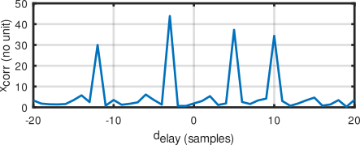

# GSL implementation of the cross-correlation through matrix multiplication

GSL being a C implementation of matrix operations, it involves multiple
functions aimed at hiding pointer operations. In the ``demo_matrix.c``
example, we use on purpose complex vector and matrics, manipulating
sub-elements of each type through their ``_view`` description. We
show how to allocate independent complex elements of the vectors
(``GSL_REAL()`` and ``GSL_IMAG()``) and address subsets of the vectors
through the ``.vector`` field of the views. The resulting code demo_matrix.c
is quite verbose but achieves the expected result:

with four peaks at the delays induced copies of the known code in the 
noisy signal.

In order to not only know that some pattern was repeated but to identify
the weight, we must calculate a pseudo-inverse, involving LU decomposition
and matrix inversion. The example is named demo_pinv.c

