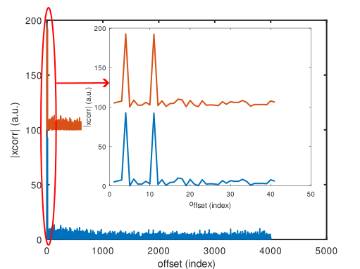
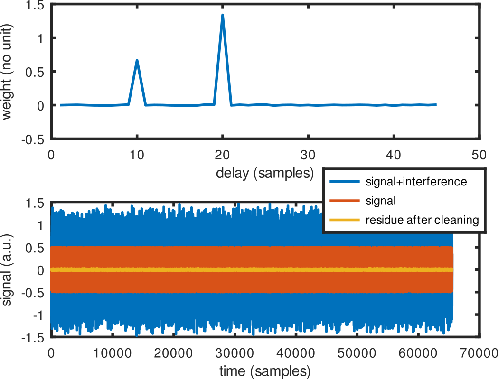
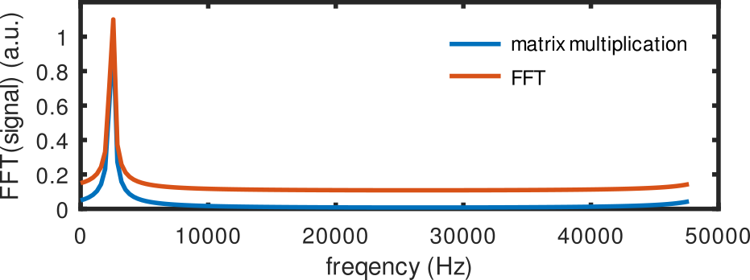

# Octave examples

## demo_xcorr

Cross correlation in the time (matrix multiplication) v.s frequency (xcorr function) domains.

## demo_pinv

While the cross correlation tells us that a pattern is repeated or found in a noisy signal, it does not
tell us what the weights of this pattern is, for example for cancelling its contribution and recovering
underlying signals buried below this pattern. Inverting the matrix representative of the linear contribution
of the pattern in the noisy signal would solve this problem: classically, there are many more observations
than weights, so that the matrix representative of time delayed copies of the pattern in the noisy signal
has many more lines (measurements) than columns (delayed copies). Inverting a non-rectangular matrix
is solved using the pseudo-inverse:

## demo_fftmatrix

The Fourier transform can be computed as a matrix multiplication of the measurement vector with a matrix
including the $\exp(j2\pi \nu t)$ coefficients with $\nu$ ranging the targeted frequencies and $t$
the measurement times. While the matrix description of the Fourier transform lacks the symmetry needed
to reduce the $O(N^2)$ complexity calculation to $O(N\ln(N))$ as achieved with the FFT, it allows
computing the spectral characteristrics even if $t$ is not evenly spaced, as long as the measuement
timestamps are known. Of course in the favorabe case of evenly space $\nu$ and $t$, the result of the
matrix multiplication is exactly the same than the FFT:

